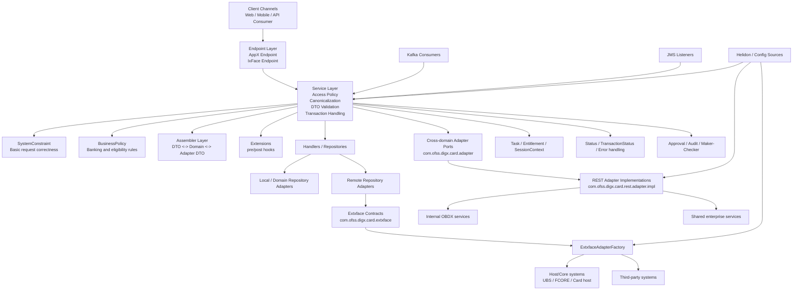

# OBDX Module Architecture Guide

This README explains OBDX module architecture using this card module as a reference. It combines:

- platform-level high-level design
- module-level low-level structure
- remote integration concepts
- adapter and `extxface` usage
- developer skills needed to work effectively on OBDX
- detailed HLD diagrams for onboarding, debugging, and design discussions

This document is written so a developer can understand both:

- how OBDX works in general
- how one OBDX module is usually built internally

## 1. What OBDX Is

OBDX (Oracle Banking Digital Experience) is a layered banking platform. A business capability is usually implemented as a module such as cards, accounts, payments, loans, onboarding, or service requests.

Each module typically exposes digital APIs and internally coordinates:

- request validation
- security and entitlements
- orchestration services
- domain/business rules
- repository and integration layers
- remote calls to host/core/third-party systems
- async messaging

In simple terms:

```text
OBDX = digital banking orchestration layer
```

It usually does not own all banking data itself. It often sits in front of:

- host systems such as UBS, FLEXCUBE, FCORE, card processors
- enterprise systems such as CRM, content, KYC, alerting
- middleware such as JMS and Kafka
- internal bank services exposed over REST/SOAP

## 2. Big Picture HLD

```text
Channel / Web / Mobile / API Consumer
               |
               v
Endpoint Layer (REST resources)
               |
               v
Service Layer (orchestration)
               |
               +--> validation
               +--> system constraints
               +--> business policies
               +--> assemblers
               +--> extensions
               |
               v
Domain / Repository Layer
               |
               +--> local repository adapter
               +--> remote repository adapter
               |
               v
Adapter / Extxface / Integration Layer
               |
               v
Host System / Third Party / JMS / Kafka / Internal Services
```

## 3. Detailed High Level Design Diagram

This diagram is intentionally detailed so it can be used during onboarding and production issue tracing.



## 4. Repository Modules in This Codebase

This repository is a good example of a typical OBDX business module.

- `com.ofss.digx.app.card.xface`
  API-facing DTOs and shared contract models
- `com.ofss.digx.app.card.xface.validators`
  DTO validator logic
- `com.ofss.digx.card.extxface`
  external/remote integration contract surface
- `com.ofss.digx.app.card.service`
  services, policies, handlers, repositories, assemblers, orchestration
- `com.ofss.digx.card.adapter`
  cross-domain adapter interfaces
- `com.ofss.digx.card.rest.adapter.impl`
  concrete adapter implementations, mostly REST-backed
- `com.ofss.digx.appx.card.endpoint`
  AppX REST exposure
- `com.ofss.digx.ixface.card.endpoint`
  IxFace/integration REST exposure
- `com.ofss.digx.jms.card.listener`
  JMS-based async listeners
- `com.ofss.digx.kafka.card.consumer`
  Kafka-based async consumers
- `com.ofss.digx.card.config.helidon.client`
  configuration sources

## 5. High-Level Components and Their Responsibilities

### 5.1 Endpoint Layer

Purpose:

- expose REST APIs
- accept request DTOs
- map HTTP path/query/body to internal calls
- pass `SessionContext`
- return API DTOs

Common characteristics:

- JAX-RS annotations
- OpenAPI annotations
- versioned URL base
- thin orchestration, not heavy business logic

Examples in this repo:

- `com.ofss.digx.appx.card.endpoint`
- `com.ofss.digx.ixface.card.endpoint`

### 5.2 Service Layer

Purpose:

- coordinate the business transaction end to end
- call validation, constraints, policies, adapters, repositories, extensions
- own request lifecycle

Typical service steps:

1. access policy check
2. canonicalize input
3. DTO validation
4. execute `SystemConstraint`
5. execute `BusinessPolicy`
6. invoke repository or handler
7. call extension hooks
8. fill `Status` / `TransactionStatus`
9. check response policy
10. encode output

Example:

- [AutoRepayment.java](C:/workspace/git/obdx-accounts/com.ofss.digx.module.card/com.ofss.digx.app.card.service/src/main/java/com/ofss/digx/app/card/service/AutoRepayment.java)

### 5.3 DTO Validation Layer

Purpose:

- validate request format and field-level correctness before deeper business evaluation

Examples:

- validators under `com.ofss.digx.app.card.xface.validators`

Typical checks:

- mandatory fields
- enum values
- field lengths
- syntax checks

### 5.4 SystemConstraint Layer

Purpose:

- validate structural or system-level request readiness
- reject incomplete or technically invalid requests early

Simple meaning:

```text
Is the request in a usable shape?
```

Example:

- [CreateAutoRepaymentSystemConstraint.java](C:/workspace/git/obdx-accounts/com.ofss.digx.module.card/com.ofss.digx.app.card.service/src/main/java/com/ofss/digx/app/card/service/CreateAutoRepaymentSystemConstraint.java)

Typical checks:

- id present
- account present
- request mode/type present
- structurally required sections present

### 5.5 BusinessPolicy Layer

Purpose:

- enforce domain and banking rules
- decide whether an operation is allowed

Simple meaning:

```text
Even if request format is valid, should the bank allow this action?
```

Examples:

- `AutoRepaymentBusinessPolicy`
- `LimitBusinessPolicy`
- `BillCycleBusinessPolicy`
- `AuthorizeTransactionBusinessPolicy`

Example file:

- [AutoRepaymentBusinessPolicy.java](C:/workspace/git/obdx-accounts/com.ofss.digx.module.card/com.ofss.digx.app.card.service/src/main/java/com/ofss/digx/domain/card/entity/credit/policy/AutoRepaymentBusinessPolicy.java)

Typical checks:

- card belongs to party
- card is active
- account relationship exists
- feature eligibility satisfied
- operation allowed for current status

### 5.6 Assembler Layer

Purpose:

- map between object models across layers

Common transformations:

- endpoint DTO -> service DTO
- service DTO -> domain object
- domain object -> adapter request DTO
- adapter response DTO -> domain/response DTO

Why it matters:

- keeps mapping logic out of service/business code
- isolates format changes

### 5.7 Repository Layer

Purpose:

- abstract persistence or remote domain interaction behind domain-friendly operations

Typical responsibilities:

- choose local or remote implementation
- hide integration selection from service
- preserve domain model style

In OBDX, repository code often delegates to:

- local repository adapter
- remote repository adapter

### 5.8 Adapter Layer

Purpose:

- define integration ports used by service/domain code
- communicate with cross-domain or enterprise capabilities

In this repo:

- `com.ofss.digx.card.adapter`

Examples:

- `ICardPartyAdapter`
- `IWorkingWindowAdapter`
- `IGenericServiceRequestAdapter`
- `ICardAccountAccessAdapter`

How it is usually used:

```java
AdapterFactory.getInstance().getAdapter(SomeAdapter.class)
```

Simple meaning:

```text
Normal OBDX integration interface used by module code
```

### 5.9 REST Adapter Implementation Layer

Purpose:

- implement adapter interfaces
- perform actual remote HTTP/service calls
- map between OBDX objects and integration payloads

In this repo:

- `com.ofss.digx.card.rest.adapter.impl`

Simple meaning:

```text
Real technical implementation behind adapter interfaces
```

### 5.10 Extxface Layer

Purpose:

- define external contract surfaces used by remote repository adapters
- support remote integration in a formal externalized contract style

In this repo:

- `com.ofss.digx.card.extxface`

Examples:

- `ICreditCardPaymentAdapter`
- `IAutoRepaymentAdapter`
- `ILimitAdapter`
- `IStatementAdapter`

How it is usually used:

```java
ExtxfaceAdapterFactory.getInstance().getAdapter(...)
```

Simple meaning:

```text
External/remote integration contract surface
```

### 5.11 Messaging Layer

Purpose:

- handle asynchronous flows
- consume or publish events/messages

In this repo:

- Kafka consumers
- JMS listeners

Typical use cases:

- party movement events
- async update propagation
- side-effect processing

### 5.12 Config Layer

Purpose:

- provide runtime configuration to services and adapter implementations
- separate code from environment-specific configuration

In this repo:

- `com.ofss.digx.card.config.helidon.client`

### 5.13 Security, Task, and Entitlement Layer

Purpose:

- control who can invoke what
- bind business actions to access rules
- enable audit and approval behavior

Common annotations:

- `@Task`
- `@Entitlement`
- `@EntitlementGroup`

Common runtime objects:

- `SessionContext`
- response/access policy framework

## 6. Low-Level View of a Typical OBDX Module

Below is the practical low-level structure a developer sees while working on one feature.

```text
Endpoint class
  -> Service class
     -> DTO validation
     -> SystemConstraint
     -> BusinessPolicy
     -> Assembler
     -> Repository / Handler
        -> Adapter / Remote Repository Adapter
           -> REST impl / Extxface Adapter
              -> Host / Third Party / Shared Service
```

### 6.1 Example Walkthrough: Auto Repayment

Using this module, the logical flow is:

1. endpoint receives request
2. service method in `AutoRepayment` starts orchestration
3. request is validated
4. `CreateAutoRepaymentSystemConstraint` checks technical request completeness
5. `AutoRepaymentBusinessPolicy` checks domain rules
6. handler/repository logic executes
7. downstream adapter/host interaction happens
8. transaction status is returned

This is one of the best examples for understanding OBDX flow because it contains:

- validation
- constraint
- business policy
- service orchestration
- downstream interaction

## 7. Core Request Lifecycle in Detail

### 7.1 Synchronous API Flow

1. request enters endpoint
2. endpoint constructs or forwards DTO
3. service checks access policy
4. service canonicalizes input
5. service calls DTO `validate`
6. `SystemConstraint` runs
7. `BusinessPolicy` runs
8. assembler converts objects if required
9. repository/handler invokes adapter or remote repository adapter
10. adapter talks to internal system, host, or third party
11. response comes back
12. service fills `Status` or `TransactionStatus`
13. response policy check runs
14. endpoint returns payload

### 7.2 Asynchronous Event Flow

1. Kafka/JMS message arrives
2. listener/consumer receives it
3. processor/service is triggered
4. service performs orchestration
5. repository/adapter updates downstream or internal state

## 8. Remote Call Architecture

When OBDX performs a remote call, the downstream system may be:

- host system such as UBS, FLEXCUBE, FCORE, card host
- internal bank platform service
- enterprise shared capability
- third-party provider
- messaging platform such as JMS/Kafka

### 8.1 Remote Call Through Adapter Layer

Typical pattern:

```text
Service -> Adapter interface -> REST adapter impl -> remote system
```

This is common for:

- cross-domain calls
- shared service calls
- technical utility integrations

Examples from this repo:

- `ICardPartyAdapter`
- `IWorkingWindowAdapter`
- `IGenericServiceRequestAdapter`

### 8.2 Remote Call Through Extxface Layer

Typical pattern:

```text
Service/Repository -> Remote Repository Adapter -> Extxface contract -> host/external system
```

This is common where repository-style remote domain interaction is used.

Example:

- [RemoteCreditCardPaymentRepositoryAdapter.java](C:/workspace/git/obdx-accounts/com.ofss.digx.module.card/com.ofss.digx.app.card.service/src/main/java/com/ofss/digx/domain/payment/entity/transfer/repository/adapter/RemoteCreditCardPaymentRepositoryAdapter.java)

In that example:

- repository adapter obtains `ICreditCardPaymentAdapter`
- data is assembled into adapter DTO
- remote processing is executed
- host reference is returned and mapped back

## 9. Adapter Layer vs Extxface Layer

This is one of the most common points of confusion.

### Adapter Layer

Location:

- `com.ofss.digx.card.adapter`

Role:

- regular cross-domain integration interfaces used by service/domain code

Factory style:

- `AdapterFactory`

Simple meaning:

- "module needs something from another module/system"

### Extxface Layer

Location:

- `com.ofss.digx.card.extxface`

Role:

- externalized remote integration contract surface, often used by remote repository adapters

Factory style:

- `ExtxfaceAdapterFactory`

Simple meaning:

- "module needs formal remote service/domain contract"

### Short Comparison

| Area | Adapter | Extxface |
|---|---|---|
| Primary usage | cross-domain module integration | remote/externalized repository-style integration |
| Typical caller | service / business policy / handler | remote repository adapter |
| Factory | `AdapterFactory` | `ExtxfaceAdapterFactory` |
| Repo example | `ICardPartyAdapter` | `ICreditCardPaymentAdapter` |

## 10. High-Level vs Low-Level Responsibility Split

### High Level

At high level, a module is responsible for:

- exposing business capabilities
- enforcing banking rules
- integrating with downstream systems
- handling security, approvals, and status reporting

### Low Level

At low level, the module is split into clear components:

- endpoints
- DTOs
- validators
- services
- system constraints
- business policies
- assemblers
- handlers
- repositories
- adapter interfaces
- adapter implementations
- extxface contracts
- event listeners/consumers
- config providers

## 11. Skills Required for an OBDX Developer

### A. Java and Enterprise Development

- Java fundamentals
- exception handling
- CDI/dependency injection
- annotation-driven frameworks
- layered architecture discipline

### B. REST and API Skills

- JAX-RS
- request/response DTO design
- OpenAPI/Swagger
- API error handling

### C. OBDX Architectural Skills

- service vs adapter vs repository separation
- `SystemConstraint` vs `BusinessPolicy`
- SPI registration and discovery
- assembler-driven mapping

### D. Security and Banking Controls

- `SessionContext`
- `@Task`
- `@Entitlement`
- audit and maker-checker concepts
- approval-aware transaction behavior

### E. Integration Skills

- host integration understanding
- REST payload mapping
- remote error handling
- cross-domain service usage
- async messaging basics

### F. Debugging Skills

- trace endpoint -> service -> policy -> repository -> adapter
- inspect transaction status and error constants
- inspect `META-INF/services`
- isolate host vs orchestration vs validation problems

### G. Banking Domain Knowledge

- accounts
- parties
- cards
- limits
- payments
- statements
- approvals
- customer-to-account relationships

## 12. How to Debug an OBDX Issue

Recommended tracing order:

1. endpoint method
2. service method
3. DTO validation
4. `SystemConstraint`
5. `BusinessPolicy`
6. assembler
7. repository/handler
8. adapter or remote repository adapter
9. REST impl or `extxface` contract
10. downstream host/third party/event flow

This order helps separate:

- bad request shape
- business rejection
- orchestration defect
- mapping issue
- integration issue
- host response issue

## 13. Common OBDX Concepts in Simple Language

- `DTO`: object moving across API/service boundaries
- `SystemConstraint`: basic technical sanity check
- `BusinessPolicy`: banking rule validator
- `Assembler`: object-to-object mapper
- `Repository`: domain-facing access abstraction
- `Adapter`: integration interface
- `Rest Adapter Impl`: real technical caller
- `Extxface`: remote contract surface
- `SessionContext`: user/session/channel execution context
- `TransactionStatus`: final operation outcome

## 14. Suggested Learning Path for a New Developer

1. Read one endpoint fully.
2. Read the matching service fully.
3. Understand DTO validation and `SystemConstraint`.
4. Understand the matching `BusinessPolicy`.
5. Trace the repository and adapter call.
6. Understand whether the flow uses `AdapterFactory` or `ExtxfaceAdapterFactory`.
7. Learn how status and exceptions are surfaced back.
8. Read one JMS/Kafka flow after understanding one synchronous API.

## 15. Useful References in This Repo

- [docs/ARCHITECTURE.md](C:/workspace/git/obdx-accounts/com.ofss.digx.module.card/docs/ARCHITECTURE.md)
- [docs/ENDPOINTS_DATAFLOW.md](C:/workspace/git/obdx-accounts/com.ofss.digx.module.card/docs/ENDPOINTS_DATAFLOW.md)
- [docs/OBJECT_DIAGRAM.md](C:/workspace/git/obdx-accounts/com.ofss.digx.module.card/docs/OBJECT_DIAGRAM.md)
- [AutoRepayment.java](C:/workspace/git/obdx-accounts/com.ofss.digx.module.card/com.ofss.digx.app.card.service/src/main/java/com/ofss/digx/app/card/service/AutoRepayment.java)
- [CreateAutoRepaymentSystemConstraint.java](C:/workspace/git/obdx-accounts/com.ofss.digx.module.card/com.ofss.digx.app.card.service/src/main/java/com/ofss/digx/app/card/service/CreateAutoRepaymentSystemConstraint.java)
- [AutoRepaymentBusinessPolicy.java](C:/workspace/git/obdx-accounts/com.ofss.digx.module.card/com.ofss.digx.app.card.service/src/main/java/com/ofss/digx/domain/card/entity/credit/policy/AutoRepaymentBusinessPolicy.java)
- [RemoteCreditCardPaymentRepositoryAdapter.java](C:/workspace/git/obdx-accounts/com.ofss.digx.module.card/com.ofss.digx.app.card.service/src/main/java/com/ofss/digx/domain/payment/entity/transfer/repository/adapter/RemoteCreditCardPaymentRepositoryAdapter.java)

## 16. Final Summary

If you remember the module in one sentence:

```text
An OBDX module is a layered orchestration unit that receives digital requests, enforces banking rules, and integrates with host or enterprise systems through repositories, adapters, and remote contracts.
```

If you remember the engineering approach in one sentence:

```text
Always trace issues layer by layer instead of jumping directly to the host system.
```

## 17. What Else May Be Required

Possible next improvements if needed:

- add a feature-wise sequence diagram for one API such as card payment or bill cycle
- add a module onboarding section with build/run/debug commands
- add a glossary for common OBDX terms
- add interview-style questions and answers for OBDX architecture
- add a host integration troubleshooting checklist
